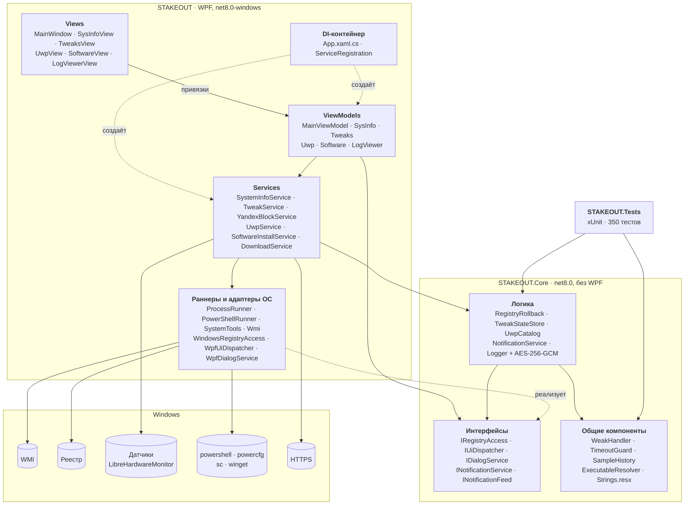
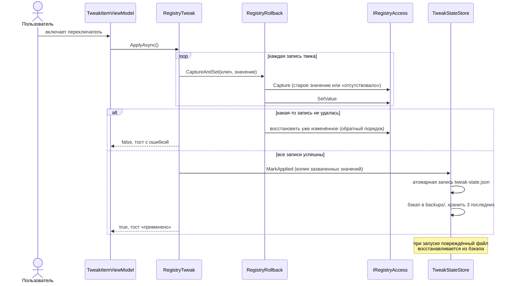
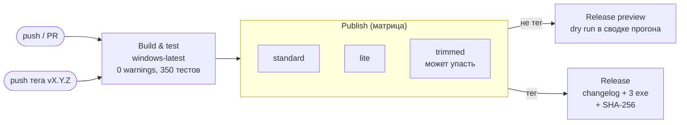

# STAKEOUT

[](https://github.com/WITTMANN88/first-pr-practice/actions/workflows/build.yml)

Оконное приложение для глубокой оптимизации Windows 10/11: системный монитор,
21 обратимый твик, удаление UWP-мусора, блокировка Яндекса, установка ПО.
Каждое изменение реестра сохраняется до применения и откатывается одной кнопкой,
в том числе после перезапуска.

- **Стек:** C# / WPF, .NET 8 (LTS), x64
- **Права:** манифест `requireAdministrator` (запрос UAC при запуске)
- **Поставка:** один `.exe` (self-contained single file), три варианта сборки
- **Журнал:** зашифрованный лог в `%TEMP%\STAKEOUT` (AES-256-GCM)

> **Статус.** Код собирается и проходит 350 unit-тестов в CI на `windows-latest`,
> но приложение ещё не проверялось запуском на реальной Windows. Перед первым
> применением твиков создайте точку восстановления системы.

## Содержание

- [Возможности](#возможности)
- [Скачать и запустить](#скачать-и-запустить)
- [Сборка из исходников](#сборка-из-исходников)
- [Архитектура](#архитектура)
- [Качество кода](#качество-кода)
- [CI/CD и релизы](#cicd-и-релизы)
- [Технические детали](#технические-детали)
- [Известные ограничения](#известные-ограничения)

## Возможности

### Система

Процессор, материнская плата, видеокарты (встроенная и дискретная отдельно),
ОЗУ с типом памяти, суммарный объём дисков, точная сборка Windows (10 и 11
различаются по номеру сборки). Источники дополняют друг друга:
LibreHardwareMonitor (температура), WMI (железо), реестр (сборка Windows, fallback).

Температура процессора обновляется каждые 3 с: бар (красный выше 85 °C) и
спарклайн за последние ~2 минуты с подписанной линией порога 85 °C.

### Твики (21, все обратимые)

| Категория | Твики |
|---|---|
| Приватность | Телеметрия (DiagTrack), Advertising ID, Cortana, блокировка сервисов Яндекса |
| Безопасность | UAC, BitLocker (через WMI) |
| Система | Обновление драйверов через Windows Update, гибернация, совместимость с гайдами |
| Интерфейс | Анимации Windows, MenuShowDelay |
| Производительность | MPO, Power Throttling, HAGS, NetworkThrottlingIndex, план «Максимальная производительность», энергосбережение USB, опрос мыши (RawMouseThrottleDuration) |
| Игры | GameDVR и службы Xbox, игровой режим, акселерация мыши |

- Деструктивные твики (UAC, BitLocker, MPO) требуют подтверждения.
- Твики интерфейса подсвечивают кнопку перезапуска Проводника.
- «Отменить все» (двойной клик, внизу бокового меню) возвращает всё применённое.

### Приложения UWP

Список всех пакетов с цветными бейджами категорий: предустановленный мусор,
игры, мультимедиа, утилиты, сторонние, прочие Microsoft, системные.
«Выбрать мусор» отмечает только предустановленный мусор. Магазин, Калькулятор,
App Installer, runtime-библиотеки и компоненты оболочки защищены: их нельзя
отметить, а удаление отклоняется и на уровне сервиса.

### Установка ПО

Chrome, 7-Zip, Discord, Steam — через `winget --interactive` (путь установки
выбирает пользователь). «Отмена» не убивает установщик (это может оставить
программу сломанной): winget отвязывается от интерфейса и завершается в фоне,
показывается тост «установка продолжается в фоне, процесс отвязан», итоговый
код выхода пишется в лог.

ISLC и MakuTweaker — прямой загрузкой по HTTPS с прогресс-баром в папку
«Загрузки». Каждый файл сверяется с закреплённым SHA-256 (защита от подмены
установщика): хеш считается при скачивании, до проверки файл лежит как
`.partial`, при несовпадении удаляется, а установка прерывается с критической
ошибкой. Без эталонного хеша загрузка не начинается.

Ссылки и хеши задаются в `src/STAKEOUT/Services/SoftwareInstallService.cs`.
ISLC закреплён (подпись Wagnardsoft проверена). **У MakuTweaker пока заглушка
`TODO: UPDATE_HASH`, поэтому его установка заблокирована**, пока не прописан
настоящий хеш (`Get-FileHash <файл> -Algorithm SHA256` по вручную скачанному
установщику с проверенной подписью). При заглушке загрузка не начинается; при
несовпадении лог записывает ожидаемый и фактический хеш.

### Журнал действий

Кнопка «Логи» открывает окно внутри приложения: лог расшифровывается на лету,
статусы подсвечены (ошибки, `ACCESS_DENIED`, `TIMEOUT` — красным), кнопка
«Скопировать в буфер».

### Интерфейс

Чёрная тема с узором (5 % непрозрачности), заставка «череп и копьё»,
сворачиваемое боковое меню (300 мс, CubicEase), тосты (5 с, ошибки
«встряхиваются»), shimmer-скелетоны при загрузке. Языки: русский (по
умолчанию) и английский (`STAKEOUT.exe --lang en` или `STAKEOUT_LANG=en`).

## Скачать и запустить

Готовые сборки прикрепляются к [релизам](https://github.com/WITTMANN88/first-pr-practice/releases)
(создаются автоматически при пуше тега, см. [CI/CD](#cicd-и-релизы)):

| Файл | Размер | Требования | Статус |
|---|---|---|---|
| `STAKEOUT-vX.Y.Z-win-x64.exe` | ~65 МБ | Windows 10/11 x64 | основной вариант |
| `STAKEOUT-vX.Y.Z-win-x64-lite.exe` | ~6 МБ | + [.NET 8 Desktop Runtime x64](https://dotnet.microsoft.com/download/dotnet/8.0) | поддерживается |
| `STAKEOUT-vX.Y.Z-win-x64-trimmed-EXPERIMENTAL.exe` | ~44 МБ | Windows 10/11 x64 | экспериментальный |

Проверка целостности (хеши также есть в описании релиза и в `SHA256SUMS.txt`):

```powershell
Get-FileHash .\STAKEOUT-v1.0.0-win-x64.exe -Algorithm SHA256
```

Исполняемый файл не подписан, поэтому SmartScreen покажет предупреждение
«Неизвестный издатель».

## Сборка из исходников

**Требования:** .NET 8 SDK (8.0.4xx). Запуск — только Windows 10/11 x64;
собрать и протестировать можно и на Linux/macOS (`EnableWindowsTargeting`).

```powershell
git clone https://github.com/WITTMANN88/first-pr-practice.git
cd first-pr-practice/src

dotnet build STAKEOUT.sln -c Release     # анализаторы включены: любое предупреждение = ошибка
dotnet test  STAKEOUT.sln -c Release     # 350 тестов, работают на любой ОС

# single-file exe → STAKEOUT\bin\Release\net8.0-windows\win-x64\publish\STAKEOUT.exe
dotnet publish STAKEOUT -c Release
dotnet publish STAKEOUT -c Release -p:StakeoutFlavor=Lite
dotnet publish STAKEOUT -c Release -p:StakeoutFlavor=Trimmed
dotnet publish STAKEOUT -c Release -p:Version=1.2.3   # версия в свойствах файла
```

Шрифт заголовков (Cinzel) уже лежит в репозитории; `STAKEOUT/prepare-assets.ps1`
перекачивает его с проверкой SHA-256.

### Варианты сборки

| Флейвор | Размер | Как устроен |
|---|---|---|
| по умолчанию | 65.4 МБ | self-contained, сжатый single file; только языки `en;ru` (−5.1 МБ) |
| `Lite` | 5.6 МБ | framework-dependent: runtime берётся из установленного .NET 8 |
| `Trimmed` | 44.4 МБ | принудительный тримминг, см. ниже |

SDK запрещает тримминг WPF (`NETSDK1168`): XAML/BAML и привязки обращаются к коду
через рефлексию, которую триммер не видит. `Trimmed` обходит запрет внутренним
ключом `_SuppressWpfTrimError`, режет только BCL-сборки, объявившие себя
trimmable (`TrimMode=partial`), а приложение, ядро, DI, WMI, LibreHardwareMonitor и их
зависимости сохраняет целиком (`Trimming/TrimmerRoots.xml`). Microsoft такую
конфигурацию не поддерживает, и отсутствие предупреждений триммера не доказывает,
что приложение работает (BAML триммеру не виден). Поэтому это экспериментальный
вариант: перед использованием каждую страницу нужно проверить на Windows.

## Архитектура

Решение разделено на WPF-оболочку и ядро без привязки к ОС. Всё, что требует
Windows (реестр, UI-поток, диалоги), скрыто за интерфейсами ядра, поэтому
логика отката, хранения, шифрования и каталогов тестируется на любой ОС.



### Применение и откат твика



### Слои и правила зависимостей

| Слой | Где | Правило |
|---|---|---|
| Views | `STAKEOUT/Views`, `MainWindow.xaml` | только привязки; code-behind — анимации и фокус |
| ViewModels | `STAKEOUT/ViewModels` | зависимости только через конструктор; уведомления через `INotificationService` |
| Композиция | `STAKEOUT/App.xaml.cs`, `Infrastructure/` | единственное место, где интерфейсы связываются с реализациями (`ValidateOnBuild`) |
| Services | `STAKEOUT/Services` | работа с ОС; каждое действие в try/catch с записью в лог |
| Раннеры | `ProcessRunner`, `PowerShellRunner`, `Wmi`, `SystemTools` | таймауты, скрытый запуск, абсолютные пути, освобождение COM-объектов |
| Core | `STAKEOUT.Core` | без WPF и Win32; покрыт тестами |

## Качество кода

### Статический анализ

Анализ — часть сборки (`src/Directory.Build.props`): любое предупреждение
компилятора, анализатора или стиля становится ошибкой, локально и в CI.

- **Microsoft.CodeAnalysis.NetAnalyzers 10.0.401**, `AnalysisMode=All` (все правила).
- **SonarAnalyzer.CSharp 10.34**, правила профиля Sonar way.
- **Стиль кода** (`.editorconfig` + `EnforceCodeStyleInBuild`): file-scoped
  namespaces, `var`, фигурные скобки у многострочных тел, модификаторы доступа,
  `readonly`-поля, именование (`_camelCase` для приватных полей), неиспользуемые
  `using`, параметры и присваивания.

Отключённые правила (каждое — осознанное решение, причина записана в `.editorconfig`):

| Правило | Где | Почему |
|---|---|---|
| CA1031 (catch всех исключений) | везде | действия пользователя оборачиваются, логируются и сообщаются; сузить catch — значит уронить процесс на неожиданном исключении WMI/COM |
| CA1062 (проверка аргументов) | везде | включены nullable-ссылки с ошибками вместо предупреждений |
| CA1863 (кэш CompositeFormat) | везде | строки формата локализованы; статический кэш зафиксировал бы первую культуру |
| CA2007 (ConfigureAwait) | WPF-проект, тесты | продолжения должны вернуться в UI-поток; в Core правило действует |
| CA1707, CA1861, S1215 | тесты | имена-предложения, массивы в Assert, `GC.Collect` в тестах утечек |
| S1135 (TODO) | везде | понижено до подсказки: TODO помечают проверки, возможные только на Windows |

Точечные подавления с обоснованием в коде: `RegHive` (значения Win32 без нуля),
`RegValueKind.String` (имя хранится в `tweak-state.json`), URL каталога ПО
(данные, а не конфигурация).

### Утечки памяти и ресурсы

- **Таймер температуры.** Dispatcher удерживает работающий `DispatcherTimer`,
  поэтому обычная подписка `Tick +=` удерживала бы ViewModel до конца процесса.
  Используется `WeakHandler` (Core): таймер не держит ViewModel, а если она
  собрана сборщиком мусора, следующий тик останавливает таймер. Подтверждено
  GC-тестами, включая мутационную проверку.
- **Окно ↔ ViewModel.** Подписка через `PropertyChangedEventManager` (слабая,
  с фильтром по свойству).
- **WMI.** Коллекции и объекты WMI (COM `IWbemClassObject`) освобождаются сразу
  после обхода (`Wmi.ForEach`), а не финализатором.
- **Процессы, HTTP, токены отмены.** Хэндлы `Process` освобождаются; `HttpClient`,
  `CancellationTokenSource` и ViewModel с таймерами освобождаются DI-контейнером при выходе.
- Привязки к неизменяемым моделям (`GpuInfo`, `LogEntry`, `Notification`)
  объявлены `OneTime`. Привязки и команды WPF к `INotifyPropertyChanged`
  уже слабые, их не трогали.

### Безопасность

- Внешние утилиты (`powershell`, `powercfg`, `sc`, `explorer`, `winget`)
  запускаются только по абсолютному пути. Иначе Windows сначала ищет их в папке
  самого exe и в текущей папке, и подложенный рядом `powercfg.exe` выполнился бы
  с правами администратора. `ProcessRunner` отклоняет относительные пути.
- Загрузки — только HTTPS с проверкой отзыва сертификатов (сервер отзыва
  недоступен → отказ) и сверкой SHA-256 с закреплённым значением.
- `%ProgramData%\STAKEOUT` доступна только SYSTEM и администраторам. Откат
  применяет записанные там значения реестра с правами администратора, а в
  подпапках ProgramData по умолчанию обычный пользователь может создавать файлы:
  подложенный бэкап состояния был бы повышением привилегий.
- Регулярные выражения — с таймаутом (защита от ReDoS).
- Лог зашифрован (AES-256-GCM, ключ PBKDF2-SHA256, 100 000 итераций, привязан к машине).
- Шрифты проверяются по SHA-256; SHA-256 exe проверяется между сборкой и релизом.

### Тесты

350 тестов xUnit (`src/STAKEOUT.Tests`, net8.0, любая ОС): шифрование лога,
движок отката на in-memory реестре, `tweak-state.json` и бэкапы, каталог UWP,
уведомления, локализация (паритет переводов), слабые обработчики (GC),
резолвер путей, запуск процессов (убийство и отвязка на настоящих дочерних
процессах), загрузка с проверкой SHA-256, спарклайн, дизайн-данные и XAML-lint
(каждый `{Binding}` ссылается на существующее свойство; у свойств с
двусторонней привязкой по умолчанию режим указан явно).

### Design-time данные

У каждого окна и страницы есть `d:DataContext="{x:Static design:DesignData.…}"`:
в дизайнере Visual Studio / Rider видны заполненные экраны (монитор с графиком,
UWP с бейджами, логи, твики, тосты). Это настоящие ViewModel на безопасных
заглушках; `d:`-атрибуты компилятор отбрасывает, поэтому в exe их нет.

## CI/CD и релизы

`.github/workflows/build.yml`:



| Job | Когда | Что делает |
|---|---|---|
| Build & test | всегда | сборка Release с анализаторами, тесты; TRX и логи MSBuild выгружаются всегда |
| Publish ×3 | если тесты зелёные | `STAKEOUT.exe` + `.sha256` для каждого варианта; на теге версия exe = версия тега |
| Release | только тег `vX.Y.Z[-pre]` | GitHub Release: changelog из коммитов с предыдущего тега, 3 exe, `.sha256`, `SHA256SUMS.txt`; тег с `-` → prerelease |
| Release preview | всё остальное | то же самое без публикации — результат в сводке прогона |

Выпуск версии:

```bash
git tag v1.0.0
git push origin v1.0.0
```

Права на запись (`contents: write`) есть только у job Release; тег проверяется
по шаблону до использования и передаётся через переменные окружения.
Упаковка и changelog — `.github/scripts/prepare-release.sh` (проверен shellcheck).

## Технические детали

**Откат.** Перед записью в реестр исходное значение (или факт его отсутствия)
сохраняется в `%ProgramData%\STAKEOUT\tweak-state.json`. Применение
транзакционно; частичный откат оставляет запись, чтобы его можно было повторить.
Файл пишется атомарно (temp + move), повреждённый переименовывается в `*.corrupt-<время>`.

**Бэкапы.** После каждого успешного сохранения (применение и отмена)
копия пишется в `backups\tweak-state.<UTC>Z.json`, хранятся 3 последние. Имена
строго возрастают даже при переводе часов назад. При повреждении основного файла
он восстанавливается из самой новой читаемой копии, приложение показывает тост.

**Уведомления.** ViewModel вызывает `INotificationService` (без code-behind);
оболочка показывает `INotificationFeed.Active`: 5 с, не больше 4 одновременно,
изменения — через UI-поток, каждое уведомление пишется в лог.

**Локализация.** Строки — `STAKEOUT.Core/Localization/Strings.resx` (русский) и
`Strings.en.resx`. XAML: `{x:Static loc:Strings.Key}`, так что опечатка ломает
сборку. Новый язык = файл `Strings.<код>.resx`; тесты сверяют ключи и плейсхолдеры.

**Температура.** 40 замеров × 3 с; шкала 30–100 °C расширяется при выходе
замера за её пределы; опрос, не уложившийся в таймаут, на график не попадает.

**Шрифт.** Cinzel (SIL OFL 1.1) встроен как WPF-ресурс (`pack://application:,,,/Assets/Fonts/#Cinzel`),
fallback — Constantia/Georgia.

### Структура репозитория

```
.editorconfig                      стиль кода и конфигурация анализаторов
.github/workflows/build.yml        CI/CD
.github/scripts/prepare-release.sh упаковка релиза и changelog
src/
  Directory.Build.props            анализаторы, warnings as errors
  STAKEOUT.sln
  STAKEOUT/                        WPF: Views, ViewModels, Services, Infrastructure, Design, Themes
  STAKEOUT.Core/                   ядро: Logging, Registry, Persistence, Uwp, Notifications, Localization, Common
  STAKEOUT.Tests/                  xUnit
```

## Известные ограничения

- Приложение ещё не запускалось на реальной Windows: проверены сборка, тесты
  и публикация в CI на `windows-latest`. Отрисовка в XAML-дизайнере не проверялась.
- Путь `RawMouseThrottleDuration` помечен `TODO` до проверки на реальной сборке Windows.
- Блокировка Яндекса (`DisallowRun`) работает по имени файла: `browser.exe`
  блокируется независимо от издателя.
- Установка MakuTweaker заблокирована до замены заглушки `TODO: UPDATE_HASH`
  настоящим SHA-256.
- План электропитания: вместо импорта `.pow`-файла дублируется встроенная схема
  «Максимальная производительность» (`e9a42b02-…`), а при откате копия удаляется.
- Ограничение прав на `%ProgramData%\STAKEOUT`, отвязка winget и разметка
  при развёртывании окна написаны без проверки на реальной Windows.
- `Trimmed` — экспериментальный вариант (см. выше); exe не подписан.
- Лицензия проекта не указана. Сторонние компоненты: Cinzel (SIL OFL 1.1),
  LibreHardwareMonitorLib (MPL-2.0), System.Management и Microsoft.Extensions.DependencyInjection (MIT).
